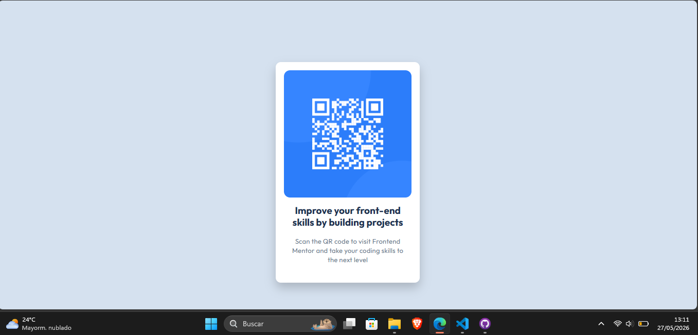

# Frontend Mentor - QR code component solution

## Table of contents

- [Overview](#overview)
  - [Screenshot](#screenshot)
  - [Links](#links)
- [My process](#my-process)
  - [Built with](#built-with)
  - [What I learned](#what-i-learned)
  - [Continued development](#continued-development)
  - [Useful resources](#useful-resources)
  - [AI Collaboration](#ai-collaboration)
- [Author](#author)
- [Acknowledgments](#acknowledgments)

## Overview

### Screenshot

### Links

- Solution URL: [Github Repository]https://github.com/David-VB03/QrCode_Component
- Live Site URL: Pendient

## My process

### Built with

- HTML5 Markup Structure
- CSS custom properties
- Mobile-first workflow
- Google Fonts

### What I learned

Use this section to recap over some of your major learnings in semantic HTML , tags, how to name tags properties using BEM and Indentation. For CSS , code the least amount of styles to manage html tags.
For last, I make sure that it'll be responsive and accesible from other people with disabilities.

### Continued development

This is only the first step for my formation in Web Development and I'll try to do the best of me , Then 
I continue working out other web callenges from Frontend Mentor and other platforms using HTML,CSS and JS from Newbie and Hard Challenges with a new knowledge learned. I hope you enjoy this travelling.

### Useful resources

- [MDN HTML](https://developer.mozilla.org/en-US/docs/Web/HTML) - This helped me for XYZ reason. I really liked this pattern and will use it going forward.

### AI Collaboration

Not Used

## Author

- Website - [Pendient](https://www.your-site.com)
- Frontend Mentor - [@David_VB03](https://www.frontendmentor.io/profile/David-VB03)
- Linkedn - [@DavidVB](https://www.linkedin.com/in/rey-david-velasquez-baylon-340943247/)

## Acknowledgments

Perhaps you worked in a team or got some inspiration from someone else's solution. This is the perfect place to give them some credit.

